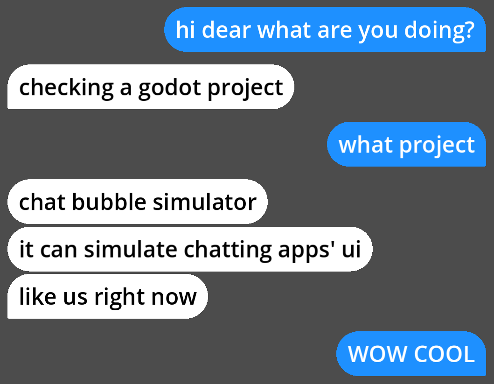

README施工中...  
[转到config.gd参考文档](.github/config_zh.md)  

# 聊天气泡模拟器(简称CBS)  

一个设计于在Godot编辑器中手动运行的项目，用来模拟聊天软件界面的气泡效果，参考效果是苹果的操作系统生态中iMessage的界面效果。  
通过使用Godot编辑器的MovieMaker功能，即可生成出表现消息逐一发送出来的动画效果的视频文件。  

另外，项目中提供了许多可供用户自由调整的自定义参数，包括且不限于：  
- 气泡的文本(聊天记录)  
- 每个气泡各自的出现时间  
- 左右两侧气泡各自的填充颜色和文本颜色  
- 文本的字体  
- 气泡的渲染精度  
- 气泡淡入动画的速度  
- 气泡在屏幕上的位置  
...更多...

## 效果预览  
  

## 使用方法  

### 0.下载Godot  
(如果您本就是Godot使用者可跳过这一步不看，您只需要知道一下**该项目使用的是4.3版本**)  
[https://godotengine.org/download/windows/](https://godotengine.org/download/windows/)  
打开此链接，您可在该页面上看见下载按钮。下载普通版本和C#版本皆可，但这里更推荐使用普通版本。  
如果上方链接访问困难，可以从Godot的[Github存储库](https://github.com/godotengine/godot)下载。

### 1.下载CBS并将其导入至Godot  
从本项目存储库的Releases中找到最新版或您心怡的版本，展开Assets列表，下载`Source code`。  
您将获得一个压缩包。解压后，您将可见压缩包内嵌套的一个`chat_bubble_simulator-x.x.x`文件夹，该文件夹中的`chat_bubble_simulator`即是项目本体。  
运行您下载并已妥善放置在合适位置的Godot引擎，将本项目的本体文件夹放置在合适位置后，在Godot的**项目管理器**窗口中选择"导入"按钮，在打开的窗口中导航至本项目的本体文件夹中的`project.godot`文件，然后选择"打开"或"导入并编辑"。  

### 2.修改用作配置文件的脚本  
在打开的Godot编辑器界面中，在"文件系统"面板中找到资源根目录(`res://`)中的文件`config.gd`，使用双击等方法将其打开。Godot编辑器会跳转到"Script"视图，在此您可以阅览并编辑文件`config.gd`中的内容。  
本文件作为一个Godot脚本文件，被本项目编写为在项目启动时执行。如您所见，该脚本中几乎都是静态变量声明并赋值的语句，这些静态变量将被本项目其余部分访问并参与相应的计算。  
本文件设计为供用户自行修改变量被声明时所赋的值而实现用户自定义配置文件的作用，简单来说本文件就是——**本项目的设置**。而用户，也就是您，可以通过修改其中各个变量的值来起到修改设置参数的效果。  
关于其中各个变量的作用和值的范围、示例，请于[这里](.github/config_zh.md)查看(该文档仍在施工中，目前尚不完整，感谢等候)。  

### 3.将生成的效果画面输出为视频文件  
您可以点击Godot编辑器右上角的"运行项目"按钮运行CBS，以测试您自定义的配置。  
您可以反复运行CBS，以便您观察效果是否符合您的预期，方便于发现不合心意的地方并随即回到`config.gd`中修改。  
完成测试后，您如果需要将画面输出为视频。首先需要在Godot编辑器右上角点击"启用MovieMaker模式"按钮，将Godot编辑器开启MovieMaker模式。在该模式下运行CBS将会在项目设置中设定的路径输出一个`.avi`视频文件。您可以在左上角点击"项目">"项目设置..."打开项目设置，在弹出的窗口中使用左侧栏导航至`编辑器`>`Movie Writer`，在这个设置页中您可以看见`电影文件`这项设置，在此您若有需要可以修改视频文件输出路径。输出视频的码率可能会非常大(CBS的默认设置大概有2.68 MiByte/秒)，因此如果您需要录制较长时间的视频，请确保您设定的输出位置所处的磁盘分区具有足够的空间。另外，您可以在该窗口的右上角开启"高级设置"，它将允许你能修改视频的诸如音频采样率、声道模式、有损压缩率等信息。将此设置页给出的所有选项都设置妥当后，您可以开始录制了。接下来只需要关闭"项目设置"窗口，回到编辑器界面，在右上角点击"运行项目"按钮，等到项目运行完自动关闭(需要在配置文件中开启自动关闭)或手动点击项目窗口的叉叉关闭它后，输出视频会在您设定好的位置等待您前来检查。  
需要注意的是：开启MovieMaker时，项目运行过程中您将不会听到声音，这是正常现象；另外，在MovieMaker录制过程中，通过点击"停止运行中的项目"按钮来结束项目运行的情况，Godot将不会保留输出的视频文件。  

### 4.视频文件过大及不是想要的格式  
对于视频体积，您可以使用**任意具有对视频进行重编码功能的软件**(也有俗称"压制")，可以是较为轻量化的工具如[HandBrake](https://github.com/HandBrake/HandBrake)，也可以是专业的视频处理软件如[Adobe Premiere Pro](https://www.adobe.com/products/premiere.html)，甚至是用命令行[FFmpeg](https://ffmpeg.org/)。  
而视频格式更是同理，具有上述功能的软件一般都会具有指定输出格式的功能，在这一步也就实现了格式的转换。  
具体如何操作需要根据您所选择的工具自行寻知求教，恕本项目的说明书不予讲述。  

## 未来更新代办  
- 重构气泡队列的格式和反序列化方式  
- 制作使用教程
